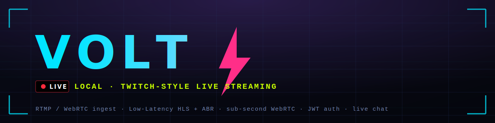

# Volt ⚡



[](https://github.com/akhilsingh-git/volt/actions/workflows/ci.yml)
[](LICENSE)

A self-contained, local **live game-streaming platform** — think a miniature Twitch you
can run on one machine with `docker compose up`. Real accounts and stream keys, gated
RTMP/WebRTC ingest, an adaptive transcode ladder, three playback latency tiers, live chat
rooms, and a clip recommender — all served same-origin from **http://localhost:8088**.

> **Screenshots:** drop your own into `docs/` and reference them here, e.g.
> `` — the UI is a neon/HUD esports theme.

```
                          ┌─────────── Volt API (FastAPI + SQLite) ───────────┐
                          │ accounts · JWT · stream keys · presence · chat    │
                          └─▲──────────────▲───────────────────────▲──────────┘
   publish auth ───────────┘    POST /chat (JWT)         heartbeat │  ▲ paths/list
                          │              │                         │  │ (liveness)
 OBS / browser ─RTMP/WHIP─▶ mediamtx ──┬─ LL-HLS ─┐                │  │
                          │            └─ WebRTC ──┤                │  │
   transcoder ◀─RTSP─ source           (WHEP)     │                │  │
        └─ 1080/720/480/360 rungs ─▶ mediamtx ─────┤                │  │
        └─ ABR master (HLS) ─▶ disk ───────────────┤                │  │
                          │                        │                │  │
   browser ◀─ :8088/ ─▶ nginx ◀─ /hls /abr /whep ──┘   :8088/api ───┘──┘
                          │  ◀─ /mqtt ─▶ mosquitto (chat, subscribe-only)
                          │  ◀─ /reco ─▶ recommender
```

## Components

| Service | Role |
|---|---|
| **`api/`** | FastAPI + SQLite — accounts, JWT auth, per-user stream keys, publish gating, chat rooms (history/presence/join-leave), channel directory, viewer presence |
| **`mediamtx/`** | Media server — RTMP ingest, **Low-Latency HLS**, **WebRTC** (WHIP publish / WHEP playback), RTSP (internal) |
| **`transcoder/`** | ffmpeg orchestrator — per-channel **ABR ladder** (1080/720/480/360) as LL-HLS rungs + a multivariant ABR master |
| **`rtmp/`** | nginx front door — serves the web app and reverse-proxies HLS / API / chat / reco |
| **`mosquitto/`** | MQTT broker — realtime chat transport; browsers are read-only (ACL), only the API publishes |
| **`reco/`** | Flask clip recommender (runs on synthetic demo models) |
| **`web/`** | The watch/broadcast UI (vanilla JS + hls.js + WebRTC) |

## Run

```bash
docker compose up -d --build
open http://localhost:8088
```

Sign up, then **Go Live**. Stream three ways:

- **Browser (no OBS):** Go Live → *Camera + mic* or *Share screen* (WebRTC/WHIP).
- **OBS / any RTMP encoder:** Server `rtmp://localhost:1935`, key `<user>?user=<user>&pass=<streamkey>`.
- **CLI test pattern:** `./stream.sh <user> --key <streamkey>` (seeded demo: `./stream.sh demo --key demokey`).

## Playback — three latency tiers

The player's quality selector + the ⚡ Real-time toggle expose every tier:

| Tier | Transport | Latency | Switching |
|---|---|---|---|
| **⚡ Real-time** | WebRTC (WHEP) | sub-second | fixed (source) |
| **Source / 1080 / 720 / 480 / 360 ⚡** | LL-HLS rung | ~1–2s | manual |
| **Auto (ABR)** | multivariant HLS | ~3–6s | automatic (adapts to bandwidth) |

Browser/WebRTC-published streams auto-route to the Real-time tier; the transcoder reads
every source over RTSP and normalizes audio to AAC, so WebRTC (Opus) and RTMP (AAC)
sources both flow through the full LL-HLS + ABR ladder.

## Auth & security model
- **Accounts:** bcrypt-hashed passwords in SQLite; 7-day JWT sessions.
- **Stream keys:** per-user secret, resettable. Publishing is gated — mediamtx calls the
  API to validate the key before accepting a frame (wrong key → rejected at the handshake).
- **Chat is spoof-proof:** browsers only *subscribe* over MQTT (broker ACL). Sends go to the
  API with a JWT and are published server-side with a verified identity.
- Dev secrets (`JWT_SECRET`, `MQTT_API_PASSWORD`, `TRANSCODER_SECRET`, reco client secret,
  `hlsCDNSecret`) live in `docker-compose.yml` for local use — **change them before exposing.**

## Endpoints

| What | URL |
|---|---|
| Watch app | http://localhost:8088/ |
| Auth | `POST /api/auth/signup` · `POST /api/auth/login` · `GET /api/me` |
| Channels (live now) | `GET /api/channels` · `GET /api/channels/<name>` |
| Chat | `GET /api/chat/<ch>/history` · `GET /api/chat/<ch>/presence` · `POST /api/chat/<ch>` |
| RTMP ingest | `rtmp://localhost:1935/<user>?user=<user>&pass=<key>` |
| WebRTC publish / play | `http://localhost:8889/<user>/whip` · `/whep` |
| LL-HLS / ABR | `http://localhost:8088/hls/<user>/index.m3u8` · `/abr/<user>/master.m3u8` |

## Chat rooms
Each channel is a room with **history** (last 50 messages replayed on join), **presence**
("N online" with usernames), and **join/leave** system messages — all published server-side
with JWT-verified identity over MQTT.

---

# Scaling this to Twitch level

Volt is architecturally faithful but runs on **one node**. Going from "works locally" to
"serves millions concurrently" is mostly a distribution, transcoding, and operations
problem. Here are the real challenges and how each is solved in production.

### 1. Distribution / CDN — the #1 scale lever
A single nginx can't fan out to millions. The dominant cost and bottleneck is *delivery*.
- **Edge CDN** (CloudFront / Fastly / Cloudflare, or your own edge tier) caches HLS
  segments close to viewers. Segments are immutable → cache them aggressively; only
  playlists are `no-cache`.
- **Origin shielding / mid-tier caching** so a viewer spike doesn't stampede the origin.
- **Multi-CDN** with steering for resilience and cost.
- *Local analog already here:* an nginx `proxy_cache` layer in front of mediamtx/transcoder
  is the same shape — add HTTP/2, immutable-segment caching, `sendfile`, keepalive.

### 2. Transcoding capacity
Software `libx264` (what the transcoder uses) is CPU-bound — ~4 encodes/channel here.
- **Hardware encoding** (NVENC / Quick Sync / AMF, or VideoToolbox on Mac) cuts CPU
  5–10× and is how platforms transcode at scale. *Note:* Docker-on-Mac has no GPU
  passthrough — run the transcoder natively or on a Linux/NVENC box.
- **Per-title / content-aware encoding** to spend bitrate only where it helps.
- **Passthrough the top rung** (don't re-encode the source resolution) to save an encode.

### 3. Autoscaling the transcode + edge fleet
- **Kubernetes + KEDA**: scale transcoder pods on queue depth / live-channel count, with
  **GPU node pools** for HW encode. Scale to zero when idle.
- Place a job queue between ingest and transcode so bursts don't drop streams.

### 4. Geo-distributed ingest
- **Ingest PoPs** so streamers connect to the nearest edge (RTMP/SRT), with **SRT** for
  lossy networks. Relay to a regional origin for packaging/transcoding.

### 5. Lower, consistent latency
- LL-HLS is tuned here (~1–2s); push further with smaller parts + HTTP/2/3.
- **WebRTC / "warp"-style** delivery for sub-second at scale (hard to fan out — needs SFUs).

### 6. Chat at scale
- Twitch chat is sharded, IRC-derived, and handles millions of concurrent connections.
- Replace single-broker MQTT with a **sharded pub/sub** (NATS / Redis Streams / Kafka),
  **Redis** for presence/history fan-out, per-room sharding, and rate-limiting/moderation
  (slow mode, bans, automod) at the edge.

### 7. State, data & VOD
- Move **SQLite → Postgres** (users, channels), **Redis** for hot state (presence, sessions,
  leaderboards), and **object storage (S3)** for recordings → **VOD/clips** pipeline.

### 8. Observability & QoE — you can't scale what you don't measure
- mediamtx exposes **Prometheus** metrics → **Grafana** dashboards.
- Track the QoE metrics platforms live by: **startup time, rebuffer ratio, glass-to-glass
  latency, ABR switches, concurrent viewers, transcode fps, ingest health.**

### 9. Reliability
- Health checks, graceful draining, multi-AZ/region failover, circuit breakers between
  tiers, and chaos testing. No single point of failure on ingest, transcode, or edge.

**TL;DR:** the interfaces here — HLS, WebRTC (WHIP/WHEP), JWT auth, MQTT topics, a stream-key
gate, an ABR ladder — are the same shapes Twitch uses. Scaling is about putting a **CDN** in
front, **hardware-accelerated + autoscaled transcoding** behind, **sharded chat/state** beside,
and **deep QoE observability** around it.

```
docker compose down -v   # stop everything + remove volumes
```
